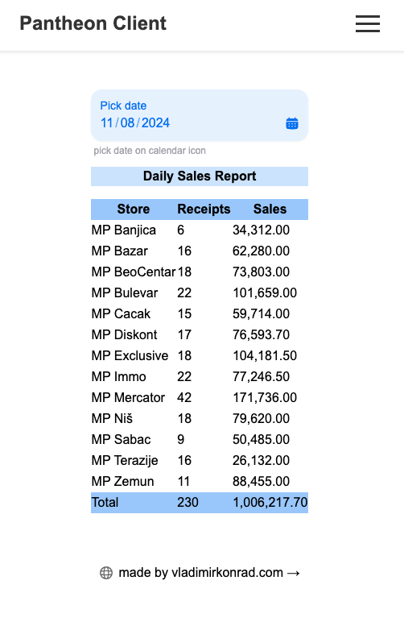

# datalab-pantheon-client-v2


## Getting Started

First, run the development server:

```bash
cp example.env .env
# enter corect values for server side
npm run dev
# or
yarn dev
# or
pnpm dev
# or
bun dev
```

Open [http://localhost:3000](http://localhost:3000) with your browser to see the result.

# DEMO light client for made in Nextjs 

## Overview

A simple client created in nexjs demonstrates the connection to the MsSQL server, using a stored procedure that returns the given data that is then distributed through the API. 
(https://github.com/vladimirkonrad/Datalab-Pantheon-API)
 And in the second part, the client accepts the data in JSON and displays it with an additional query.
The example shows the daily sales of multiple stores, and the date selection can also be viewed for earlier periods.
The data was based on DataLab Pantheon, perhaps the most popular and complete ERP application used in the region of the former Yugoslavia.

## API Response

The API returns a response object that conforms to the `ApiResponse` interface, which contains two properties:

* `result1`: an array of `SalesData` objects
* `result2`: a single `TotalSales` object

## Sales Data

The `SalesData` interface represents a single sales data record with the following properties:

* `MP`
* `Naziv`
* `BrojRacuna`
* `Pazar`
* `PazarNoFormat`

## Total Sales

The `TotalSales` interface represents a single total sales record with the following properties:

* `Pazar`
* `PazarNoFormat`

## Getting Started

To get started with this project, please refer to the documentation for the API endpoint and the `ApiResponse` interface.
For server side check https://github.com/vladimirkonrad/Datalab-Pantheon-API 

## Contributing

Contributions are welcome! Please submit a pull request with your changes.

## License

[Insert license information here]
## Deploy on Vercel

The easiest way to deploy your Next.js app is to use the [Vercel Platform](https://vercel.com/new?utm_medium=default-template&filter=next.js&utm_source=create-next-app&utm_campaign=create-next-app-readme) from the creators of Next.js.

Check out our [Next.js deployment documentation](https://nextjs.org/docs/app/building-your-application/deploying) for more details.

